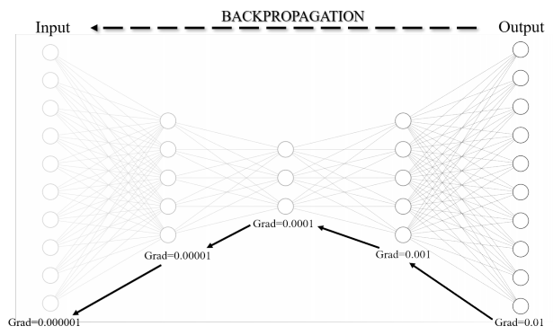

# Introduction 

Vanishing Gradient is a common problem when increasing the complexity of a model by adding more layers to learn more complex features from a large
dataset. As the model gets deeper, during backpropagation, the gradient decreases with each layer. This results in the weights receiving little,
or no, updates after each iteration, making it nearly impossible for the model to learn. This problem is called Vanishing Gradient. 



# Signal 

Vanishing Gradients are typically identified by several typical signs:
- The weights of layers near the output layer change significantly, while the weights of layers near the input layer change little or hardly change.
- The weights may gradually approach zero during training, reducing the update efficiency.
- The model learns very slowly, and the training process may stall very early, often after the first few epochs.
- The distribution of the weights is concentrated around zero, limiting the ability to transfer information across the network layers. 

The main cause of the Vanishing Gradient phenomenon comes from the chain
rule in the backpropagation process. The gradient in the layers near the input layer gradually decreases according to the product of the gradients through the previous layers, leading to almost zero in deep networks. This is one of the biggest challenges in training a deep neural network, requiring effective processing methods to overcome. 

# Solution 

Some methods to fix Vanishing Gradient are mentioned in the project: 

- Activation Function
- Optimizer 
- Normalization 
- Skip Connection 

\


# Pipeline 

In this project, I will explore the Vanishing Gradient problem in MLP networks and test solutions to improve the learning efficiency of the model. The overview includes:
1. Set up a typical MLP network that is susceptible to Vanishing Gradient with the following characteristics: Sigmoid activation function, large depth, and suboptimal structure to observe how the gradient gradually decreases through the layers.
2. Test different solutions to overcome Vanishing Gradient and evaluate the improvement. The solutions include:

- (a) Weight Increasing: Change the initial weight initialization to increase the gradient value, thereby minimizing the possibility of the gradient becoming too small.

- (b) Better Activation: Test advanced activation functions that do not saturate as easily as Sigmoid, to keep the gradient more stable.

- (c) Better Optimizer: Use more modern optimization algorithms to speed up convergence and minimize the Vanishing Gradient problem.

- (d) Normalize Inside Network: Apply normalization techniques to keep the output value within a stable range, thereby preventing the gradient from decreasing too quickly across layers.

- (e) Skip Connection: Integrate skip connections into the network architecture to create a direct gradient path from previous layers to later layers, as the ResNet architecture has proven effective.

- (f) Train Layers Separately (Fine-Tuning): Train layers sequentially to minimize the impact of deeper layers on the gradient.

- (g) Gradient Normalization: Normalize the gradient during backpropagation to maintain a reasonable gradient value.


# Installation
To run this project, install the required dependencies listed in requirements.txt:
```bash
pip install -r requirements.txt
```

# Usage 

1. Clone the repository: 
```bash
git clone https://github.com/NamNguyenWork27/Vanishing-Gradient.git
```

2. Navigate to the project directory:

```bash
cd Vanishing-Gradient
```

3. Run on local deployment:
```bash
streamlit run app.py
```


